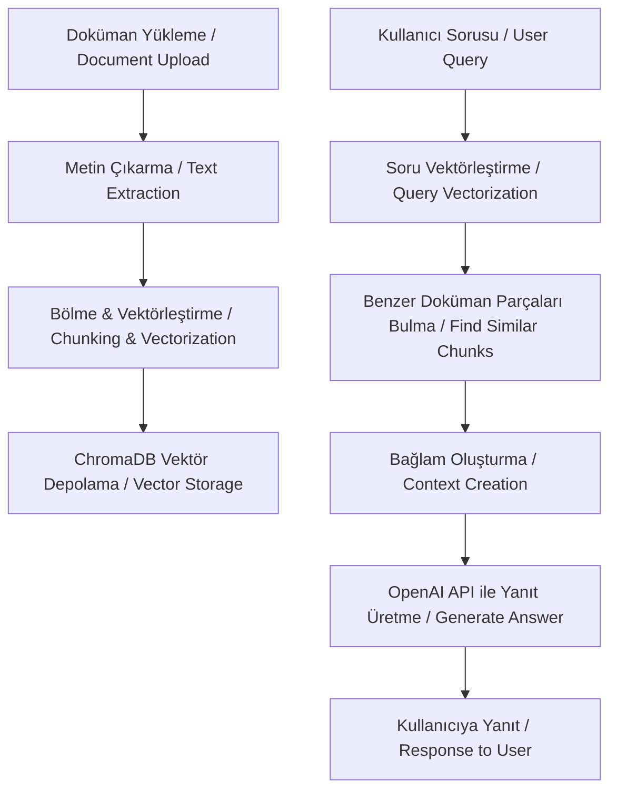

<div align="center">
  <h1>🧠 Syllexa AI</h1>
  <p>
    <strong>- Disleksi dostu yapay zeka asistanı - </strong><br>
    <em>- Dyslexia-friendly AI assistant -</em>
  </p>
</div>

## 📋 İçerik / Contents

- [🚀 Proje Hakkında / About](#-proje-hakkında--about)
- [✨ Özellikler / Features](#-özellikler--features)
- [💻 Teknolojiler / Technologies](#-teknolojiler--technologies)
- [🏗️ Mimari / Architecture](#️-mimari--architecture)
- [🔧 Kurulum / Installation](#-kurulum--installation)
- [🖥️ Kullanım / Usage](#️-kullanım--usage)
- [👥 Katkıda Bulunma / Contributing](#-katkıda-bulunma--contributing)
- [📄 Lisans / License](#-lisans--license)

## 🚀 Proje Hakkında / About

Syllexa AI, disleksi rahatsızlığı olan kullanıcılar için özel olarak tasarlanmış, konuşma ve metin iletişimini destekleyen kapsamlı bir dijital asistan uygulamasıdır. Disleksi hastalarının konuşmalarındaki bozuklukları düzeltmeye ve günlük iletişimlerini kolaylaştırmaya yardımcı olur. Kullanıcılar asistanla sesli olarak birebir konuşabilir, metin tabanlı sohbet edebilir, ayrıca belge yükleyerek bu belgeler üzerinden sorular sorabilirler. RAG (Retrieval Augmented Generation) teknolojisi sayesinde hem disleksi dostu iletişim hem de belge tabanlı bilgi erişimi sağlanmaktadır.

*Syllexa AI is a comprehensive digital assistant application specially designed for users with dyslexia, supporting both speech and text communication. It helps correct speech abnormalities in dyslexic users and facilitates their daily communication. Users can have one-on-one voice conversations with the assistant, engage in text-based chat, and also upload documents to ask questions about them. Thanks to RAG (Retrieval Augmented Generation) technology, both dyslexia-friendly communication and document-based information access are provided.*

## ✨ Özellikler / Features

- 🎙️ **Sesli İletişim / Voice Communication**: Birebir sesli konuşma desteği (voice-to-voice)
- 💬 **Disleksi Dostu Sohbet / Dyslexia-Friendly Chat**: Konuşma ve yazım bozukluklarını düzelten özel eğitimli model
- 📑 **Doküman İşleme / Document Processing**: PDF, DOCX ve TXT formatlarını destekler
- 🔍 **Bağlam Tabanlı Yanıtlar / Context-Based Answers**: RAG teknolojisi ile dokümanlardan ilgili bilgileri çıkarır
- 🧠 **Hafıza / Contextual Memory**: Her sohbet için önceki konuşmaları hatırlar ve bağlamı korur
- 🗣️ **Çoklu İletişim Modları / Multiple Communication Modes**: Ses-ses (voice-to-voice), metin-metin (text-to-text), metin-ses (text-to-voice), ses-metin (voice-to-text)
- 🌐 **Çoklu Dil Desteği / Multi-language Support**: Türkçe ve İngilizce
- 🔐 **Güvenli Giriş / Secure Login**: JWT, Google ve Facebook ile giriş seçenekleri
- 👁️ **Disleksi Dostu Arayüz / Dyslexia-Friendly Interface**: Kullanıcı deneyimini iyileştirmek için özel tasarlanmış UI

## 💻 Teknolojiler / Technologies

### Backend

- **Framework**: FastAPI
- **Veritabanı / Database**: PostgreSQL + SQLAlchemy ORM
- **AI Servisleri / AI Services**: OpenAI API, LangChain
- **Vektör Veritabanı / Vector Database**: ChromaDB
- **Doküman İşleme / Document Processing**: PyPDF, Python-docx
- **Kimlik Doğrulama / Authentication**: JWT, OAuth2

### Frontend

- **Framework**: React (v19)
- **Yapı Aracı / Build Tool**: Vite
- **UI Kütüphaneleri / UI Libraries**: Material UI, Tailwind CSS, Bootstrap
- **API İletişimi / API Communication**: Axios
- **Routing**: React Router
- **Ses İşleme / Audio Processing**: Recorder-js

## 🏗️ Mimari / Architecture

### RAG İş Akışı / RAG Workflow



### Sistem Mimarisi / System Architecture

```
📁 backend/
  ├── 📁 app/
  │   ├── 📁 api/
  │   │   ├── 📁 routes/
  │   │   │   ├── 📄 auth_routes.py      # Kimlik doğrulama rotaları
  │   │   │   ├── 📄 chat_routes.py      # Sohbet ve RAG rotaları
  │   │   │   └── 📄 user_routes.py      # Kullanıcı yönetimi rotaları
  │   ├── 📁 core/
  │   │   ├── 📄 config.py               # Uygulama yapılandırması ve API anahtarları
  │   │   ├── 📄 security.py             # JWT işlemleri
  │   │   ├── 📁 db/
  │   │   │   ├── 📄 models.py               # Veritabanı modelleri
  │   │   │   ├── 📄 database.py             # Veritabanı bağlantısı
  │   │   │   └── 📄 queries.py              # Veritabanı sorguları
  │   ├── 📁 services/
  │   │   ├── 📄 openai_service.py       # OpenAI API entegrasyonu
  │   │   ├── 📄 rag_service.py          # RAG işleme servisi
  │   │   └── 📄 document_processor.py     # Doküman işleme yardımcıları
  │   ├── 📁 utils/
  │   │   └── 📄 main.py                     # Ana FastAPI uygulaması
  └── 📄 .requirements.txt               # Bağımlılıklar

📁 frontend/
  ├── 📁 src/
  │   ├── 📁 components/                 # UI bileşenleri
  │   ├── 📁 pages/                      # Sayfa bileşenleri
  │   ├── 📁 context/                    # React context sağlayıcıları
  │   ├── 📁 services/                   # API iletişim servisleri
  │   ├── 📁 utils/                      # Yardımcı fonksiyonlar
  │   └── 📄 App.jsx                     # Ana React uygulaması
```

## 🔧 Kurulum / Installation

### Ön Koşullar / Prerequisites

- Python 3.9+
- PostgreSQL
- OpenAI API Anahtarı / API Key

### Backend Kurulumu / Backend Setup

```bash
# Repo'yu klonla / Clone repository
git clone https://github.com/Efe-Eroglu/syllexa-ai-agent.git
cd syllexa-ai-agent/backend

# Sanal ortam oluştur / Create virtual environment
python -m venv venv
source venv/bin/activate  # Linux/Mac
venv\Scripts\activate  # Windows

# Bağımlılıkları yükle / Install dependencies
pip install -r .requirements.txt

# .env dosyasını oluştur / Create .env file
cp sample.env .env
# .env dosyasını düzenle / Edit .env file

# Sunucuyu başlat / Start server
uvicorn app.main:app --reload
```

### Frontend Kurulumu / Frontend Setup

```bash
# Frontend dizinine git / Go to frontend directory
cd frontend

# Geliştirme sunucusunu başlat / Start development server
npm run dev
```

## 🖥️ Kullanım / Usage

1. Hesap oluşturun veya giriş yapın / Create an account or log in
2. Ana sayfadan "Yeni Sohbet" seçeneğini tıklayın / Click "New Chat" on the home page
3. Tercih ettiğiniz iletişim modunu seçin (sesli veya yazılı) / Choose your preferred communication mode (voice or text)
4. Disleksi asistanıyla doğrudan konuşun veya yazışın / Talk or text directly with the dyslexia assistant
5. Doküman yükleyebilir ve belgeleriniz hakkında sorular sorabilirsiniz / Optionally upload documents and ask questions about them
6. Sesli iletişim için mikrofon simgesini kullanın / Use microphone icon for voice interaction

### İletişim Modları / Communication Modes

- **Ses-Ses (Voice-to-Voice)**: Asistanla doğrudan konuşun ve sesli yanıt alın
- **Metin-Metin (Text-to-Text)**: Yazılı olarak sorun ve yazılı yanıt alın
- **Ses-Metin (Voice-to-Text)**: Konuşarak sorun ve yazılı yanıt alın
- **Metin-Ses (Text-to-Voice)**: Yazılı olarak sorun ve sesli yanıt alın

### Ek Özellikler / Additional Features

- **Disleksi Düzeltme / Dyslexia Correction**: Konuşma ve yazım hatalarını otomatik düzeltme
- **Doküman Yönetimi / Document Management**: Daha önce yüklenen dokümanları görüntüleyin ve yönetin
- **Sohbet Geçmişi / Chat History**: Önceki sohbetlerinize erişin
- **Kullanıcı Ayarları / User Settings**: Arayüz görünümünü ve disleksi ayarlarını özelleştirin

## 👥 Katkıda Bulunma / Contributing

Katkılarınızı memnuniyetle karşılıyoruz! Lütfen bir Pull Request açın veya önerileriniz için bir Issue oluşturun.

*Contributions are welcome! Please open a Pull Request or create an Issue for your suggestions.*

## 📄 Lisans / License

Bu proje MIT lisansı altında lisanslanmıştır. Detaylar için [LICENSE](LICENSE) dosyasına bakın.

*This project is licensed under the MIT License. See the [LICENSE](LICENSE) file for details.*


